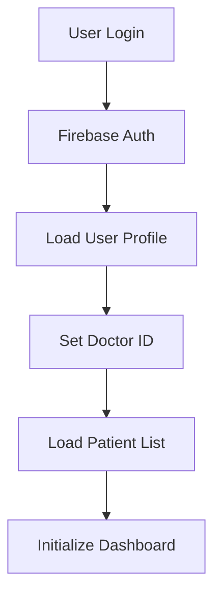
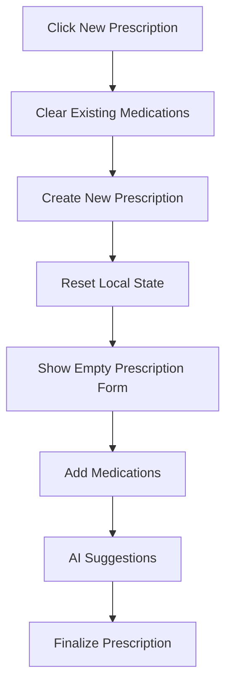
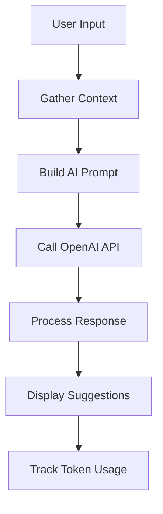

# Technical Implementation Guide

## Architecture Overview

### Frontend Stack
- **Svelte 5.x**: Reactive framework for building user interfaces
- **Tailwind CSS**: Utility-first CSS framework for styling
- **Flowbite**: Component library built on Tailwind CSS
- **Font Awesome**: Icon library for UI elements
- **ApexCharts**: Chart library for data visualization
- **jsPDF**: PDF generation library

### Backend Services
- **Firebase Firestore**: NoSQL database for data storage
- **Firebase Auth**: Authentication and user management
- **Firebase Hosting**: Static site hosting
- **OpenAI API**: AI-powered drug suggestions and medical analysis

## Key Components

### 1. PatientDetails.svelte
**Purpose**: Main patient management interface
**Key Features**:
- Patient information display with conditional rendering
- Tab-based navigation (Overview, Symptoms, Reports, Diagnoses, Prescriptions)
- AI-powered drug suggestions
- Prescription management
- Current medications tracking

**Technical Implementation**:
```javascript
// Conditional rendering for empty fields
{#if patient.firstName || patient.lastName}
  <h6 class="mb-1">{patient.firstName} {patient.lastName}</h6>
{/if}

// Current medications with duration calculation
function getCurrentMedications() {
  return selectedPatient?.prescriptions?.flatMap(p => 
    p.medications?.filter(med => isMedicationStillActive(med)) || []
  ) || []
}
```

### 2. AdminDashboard.svelte
**Purpose**: Administrative controls and analytics
**Key Features**:
- Doctor token quota management
- AI usage analytics
- System configuration
- User management

**Technical Implementation**:
```javascript
// Token quota management
async function saveQuota() {
  await aiTokenTracker.setDoctorQuota(selectedDoctorId, quotaInput)
  await refreshDoctorUsageStats()
  closeQuotaModal()
}

// Default quota application
async function applyDefaultQuotaToAll() {
  const doctors = await firebaseStorage.getAllDoctors()
  for (const doctor of doctors) {
    await aiTokenTracker.setDoctorQuota(doctor.id, defaultQuotaInput)
  }
}
```

### 3. AIRecommendations.svelte
**Purpose**: AI-powered drug suggestions and analysis
**Key Features**:
- OpenAI API integration
- Context-aware suggestions
- Drug interaction checking
- Medical analysis

**Technical Implementation**:
```javascript
// Enhanced AI context
const additionalContext = {
  patientCountry: patientData?.country || 'Not specified',
  currentActiveMedications: patientData?.currentActiveMedications || [],
  doctorCountry: patientData?.doctorCountry || 'Not specified'
}

// AI prompt generation
const prompt = `Patient: ${ageText}${genderText}${allergiesText}${longTermMedsText}
Symptoms: ${symptomsText}
${currentMedsText}
${currentActiveMedsText}
Patient Country: ${effectivePatientCountry}`
```

## Data Flow

### 1. Authentication Flow


### 2. Prescription Creation Flow


### 3. AI Integration Flow


## Database Schema

### Collections Structure
```
doctors/
  - id: string
  - email: string
  - firstName: string
  - lastName: string
  - country: string
  - city: string
  - createdAt: timestamp

patients/
  - id: string
  - firstName: string
  - lastName: string
  - dateOfBirth: string
  - phone: string
  - email: string
  - doctorId: string
  - createdAt: timestamp

medications/
  - id: string
  - patientId: string
  - doctorId: string
  - medications: array
  - status: string
  - createdAt: timestamp
  - updatedAt: timestamp
```

## Security Implementation

### Doctor Isolation
```javascript
// Ensure doctor can only access their own patients
async function loadPatients() {
  const q = query(
    collection(db, 'patients'),
    where('doctorId', '==', doctorId)
  )
  const querySnapshot = await getDocs(q)
  return querySnapshot.docs.map(doc => ({
    id: doc.id,
    ...doc.data()
  }))
}
```

### Data Validation
```javascript
// Input sanitization
function sanitizeInput(input) {
  return input.trim().replace(/[<>]/g, '')
}

// Validation before saving
function validatePatientData(data) {
  if (!data.firstName || !data.lastName) {
    throw new Error('Name is required')
  }
  if (data.email && !isValidEmail(data.email)) {
    throw new Error('Invalid email format')
  }
}
```

## Performance Optimizations

### 1. Reactive Statements
```javascript
// Efficient reactive updates
$: if (patients.length > 0 && !statisticsLoading) {
  loadStatistics()
}

// Prevent unnecessary re-renders
$: filteredPatients = patients.filter(patient => 
  patient.firstName.toLowerCase().includes(searchTerm.toLowerCase())
)
```

### 2. Lazy Loading
```javascript
// Dynamic imports for heavy components
const PrescriptionPDF = lazy(() => import('./PrescriptionPDF.svelte'))
const AIRecommendations = lazy(() => import('./AIRecommendations.svelte'))
```

### 3. Firebase Optimization
```javascript
// Efficient queries with proper indexing
const q = query(
  collection(db, 'medications'),
  where('patientId', '==', patientId),
  orderBy('createdAt', 'desc'),
  limit(10)
)
```

## Error Handling

### Global Error Boundary
```javascript
// Error handling wrapper
function handleError(error, context) {
  console.error(`Error in ${context}:`, error)
  // Log to monitoring service
  // Show user-friendly message
}
```

### API Error Handling
```javascript
// OpenAI API error handling
try {
  const response = await openai.chat.completions.create({
    model: "gpt-3.5-turbo",
    messages: messages,
    max_tokens: 600
  })
  return response.choices[0].message.content
} catch (error) {
  if (error.code === 'insufficient_quota') {
    throw new Error('AI quota exceeded. Please contact administrator.')
  }
  throw new Error('AI service temporarily unavailable.')
}
```

## Testing Strategy

### Unit Tests
- Component logic testing
- Utility function testing
- API service testing

### Integration Tests
- Firebase operations
- AI API integration
- User authentication flow

### E2E Tests
- Complete user workflows
- Cross-browser compatibility
- Mobile responsiveness

## Deployment

### Build Process
```bash
npm run build
# Generates optimized production bundle
# Minifies CSS and JavaScript
# Optimizes images and assets
```

### Firebase Deployment
```bash
firebase deploy
# Deploys to Firebase Hosting
# Updates Firestore rules
# Deploys Cloud Functions (if any)
```

## Monitoring and Analytics

### Performance Monitoring
- Bundle size tracking
- Load time monitoring
- User interaction analytics

### Error Tracking
- Console error logging
- API error monitoring
- User feedback collection

### Usage Analytics
- AI token usage tracking
- Feature usage statistics
- User engagement metrics


