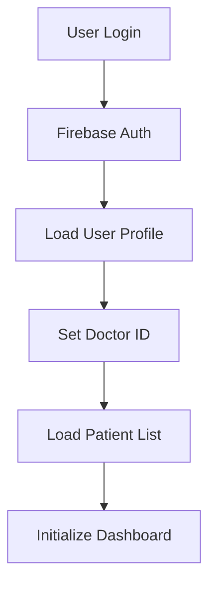
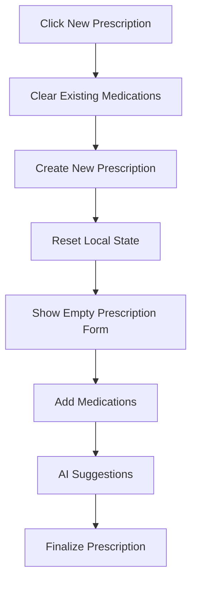
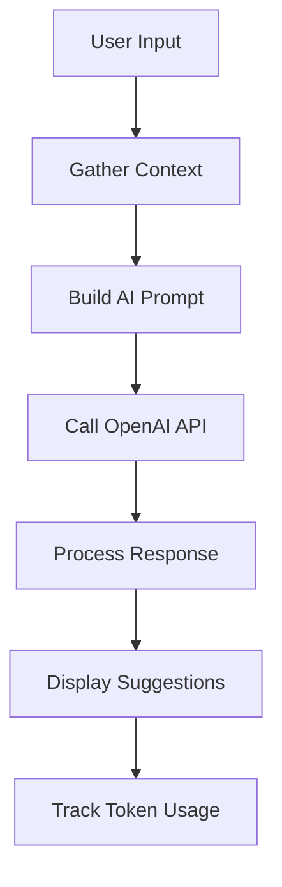

# Technical Implementation Guide

## Architecture Overview

### Frontend Stack
- **Svelte 5.x**: Reactive framework for building user interfaces
- **Tailwind CSS**: Utility-first CSS framework for styling
- **Flowbite**: Component library built on Tailwind CSS
- **Font Awesome**: Icon library for UI elements
- **ApexCharts**: Chart library for data visualization
- **jsPDF**: PDF generation library

### Backend Services
- **Firebase Firestore**: NoSQL database for data storage
- **Firebase Auth**: Authentication and user management
- **Firebase Hosting**: Static site hosting
- **OpenAI API**: AI-powered drug suggestions and medical analysis

## Dispensed Status System

### Architecture Overview
The dispensed status system enables doctors to see which medications have been dispensed from connected pharmacies while maintaining strict decoupling between doctor and pharmacist portals.

### Key Components

#### 1. prescriptionStatusService.js
**Purpose**: Service layer for secure cross-portal communication
**Location**: `src/services/doctor/prescriptionStatusService.js`

**Key Features**:
- Fetches dispensed status from pharmacist portal
- Maps prescription IDs between doctor and pharmacist systems
- Handles multiple ID formats and mapping strategies
- Provides secure, authenticated data access

**Technical Implementation**:
```javascript
// Main function to get patient prescription status
export async function getPatientPrescriptionsStatus(patientId, doctorId) {
  try {
    const prescriptionsRef = collection(db, 'pharmacistPrescriptions')
    const q = query(
      prescriptionsRef,
      where('patientId', '==', patientId),
      where('doctorId', '==', doctorId)
    )
    
    const prescriptionsSnapshot = await getDocs(q)
    const patientStatus = {}
    
    prescriptionsSnapshot.forEach((doc) => {
      const data = doc.data()
      const pharmacistPrescriptionId = data.prescriptionId || doc.id
      
      // Create status object
      const statusInfo = {
        isDispensed: data.status === 'dispensed' || !!data.dispensedAt,
        dispensedAt: data.dispensedAt || data.updatedAt,
        dispensedBy: data.pharmacistName || 'Pharmacy',
        dispensedMedications: data.dispensedMedications || []
      }
      
      // Multiple mapping strategies
      patientStatus[pharmacistPrescriptionId] = statusInfo
      
      // Map using prescriptions field
      if (data.prescriptions && data.prescriptions.length > 0) {
        data.prescriptions.forEach(pres => {
          if (pres.id) {
            patientStatus[pres.id] = statusInfo
          }
        })
      }
      
      // Extract doctor ID from pharmacist ID format
      if (pharmacistPrescriptionId.includes('_')) {
        const parts = pharmacistPrescriptionId.split('_')
        if (parts.length >= 2) {
          const doctorPrescriptionId = parts.slice(1).join('_')
          patientStatus[doctorPrescriptionId] = statusInfo
        }
      }
    })
    
    return patientStatus
  } catch (error) {
    console.error('Error fetching prescription status:', error)
    return {}
  }
}
```

#### 2. PatientManagement.svelte - Dispensed Status Integration
**Purpose**: Display dispensed status in Last Prescription card
**Location**: `src/components/PatientManagement.svelte`

**Key Features**:
- Loads dispensed status for selected patient
- Displays dispensed badges for individual medications
- Handles prescription ID mapping and lookup
- Maintains reactive updates when patient changes

**Technical Implementation**:
```javascript
// Load dispensed status when patient changes
$: if (selectedPatient?.id && doctorId) {
  loadDispensedStatus()
}

// Function to load dispensed status
const loadDispensedStatus = async () => {
  try {
    checkingDispensedStatus = true
    const status = await prescriptionStatusService.getPatientPrescriptionsStatus(
      selectedPatient.id, 
      doctorId
    )
    prescriptionDispensedStatus = status
  } catch (error) {
    console.error('Error loading dispensed status:', error)
    prescriptionDispensedStatus = {}
  } finally {
    checkingDispensedStatus = false
  }
}

// Enhanced prescription info lookup with mapping
const getPrescriptionDispensedInfo = (prescriptionId) => {
  // First try direct lookup
  if (prescriptionDispensedStatus[prescriptionId]) {
    return prescriptionDispensedStatus[prescriptionId]
  }
  
  // If not found, try to find by checking all mapped IDs
  for (const [mappedId, status] of Object.entries(prescriptionDispensedStatus)) {
    if (mappedId.includes(prescriptionId) || prescriptionId.includes(mappedId)) {
      return status
    }
  }
  
  // Fallback
  return {
    isDispensed: false,
    dispensedAt: null,
    dispensedBy: null,
    dispensedMedications: []
  }
}

// Check if specific medication is dispensed
const isMedicationDispensed = (prescriptionId, medicationId) => {
  const dispensedInfo = getPrescriptionDispensedInfo(prescriptionId)
  
  if (!dispensedInfo.dispensedMedications || !Array.isArray(dispensedInfo.dispensedMedications)) {
    return false
  }
  
  return dispensedInfo.dispensedMedications.some(dispensedMed => 
    dispensedMed.medicationId === medicationId || 
    dispensedMed.medicationId === medicationId.toString() ||
    dispensedMed.name === medicationId ||
    dispensedMed.name === medicationId.toString()
  )
}
```

### Data Flow

1. **Doctor selects patient** → `PatientManagement.svelte` loads patient data
2. **Dispensed status request** → `prescriptionStatusService.js` queries pharmacist data
3. **ID mapping** → Service maps pharmacist prescription IDs to doctor prescription IDs
4. **Status display** → Last Prescription card shows dispensed badges for medications
5. **Reactive updates** → Status updates automatically when patient changes

### Security & Decoupling Rules

#### Strict Decoupling Requirements
- **No Direct Database Access**: Doctor portal cannot directly access pharmacist collections
- **Service Layer Only**: All cross-portal communication must go through dedicated services
- **Authentication Required**: All requests must include proper doctor ID authentication
- **Read-Only Access**: Doctor portal can only read dispensed status, not modify it

#### Implementation Guidelines
- **Error Handling**: Graceful fallback when dispensed status cannot be loaded
- **Performance**: Efficient queries with proper indexing
- **Logging**: Comprehensive logging for debugging and monitoring
- **Maintainability**: Clear separation of concerns for future development

### Database Schema

#### pharmacistPrescriptions Collection
```javascript
{
  id: "1759489790864_QcQ2QKhwG96o3lL75nYx", // pharmacist-generated ID
  prescriptionId: "Y7jq3ClVVPNeUtTXgvQ9", // doctor's prescription ID
  patientId: "WHEfyan2d8EnMTsX4QXv",
  doctorId: "e4ShvOGQGkQOiSAVEgRt",
  status: "dispensed",
  dispensedAt: "2025-10-03T11:10:29.205Z",
  dispensedBy: "Pharmacy Name",
  dispensedMedications: [
    {
      medicationId: "mgaqry69e1c4ra7ts7t",
      name: "Medication Name",
      prescriptionId: "Y7jq3ClVVPNeUtTXgvQ9"
    }
  ],
  prescriptions: [
    {
      id: "Y7jq3ClVVPNeUtTXgvQ9", // doctor's prescription ID
      // ... other prescription data
    }
  ]
}
```

## Key Components

### 1. PatientDetails.svelte
**Purpose**: Main patient management interface
**Key Features**:
- Patient information display with conditional rendering
- Tab-based navigation (Overview, Symptoms, Reports, Diagnoses, Prescriptions)
- AI-powered drug suggestions
- Prescription management with notes field
- Current medications tracking
- Prescription notes integration
- Dispensed status integration (Last Prescription card only)

**Technical Implementation**:
```javascript
// Conditional rendering for empty fields
{#if patient.firstName || patient.lastName}
  <h6 class="mb-1">{patient.firstName} {patient.lastName}</h6>
{/if}

// Current medications with duration calculation
function getCurrentMedications() {
  return selectedPatient?.prescriptions?.flatMap(p => 
    p.medications?.filter(med => isMedicationStillActive(med)) || []
  ) || []
}

// Prescription notes integration
let prescriptionNotes = ''

// Notes field in PrescriptionsTab component
bind:prescriptionNotes
```

### 2. PharmacistDashboard.svelte
**Purpose**: Pharmacist portal for prescription management and inventory
**Key Features**:
- Individual drug dispatch status tracking
- Responsive mobile-first design
- Advanced inventory management
- Prescription viewing and management
- Enhanced warning system

**Technical Implementation**:
```javascript
// Individual medication dispatch tracking
let dispensedMedications = new Set()

function toggleMedicationDispatch(prescriptionId, medicationId) {
  const key = `${prescriptionId}-${medicationId}`
  if (dispensedMedications.has(key)) {
    dispensedMedications.delete(key)
  } else {
    dispensedMedications.add(key)
  }
  dispensedMedications = new Set(dispensedMedications) // Trigger reactivity
}

// Enhanced warning system
function markSelectedAsDispensed() {
  if (dispensedMedications.size === 0) {
    notifyError('⚠️ No medications selected! Please check the boxes next to the medications you want to mark as dispensed.')
    return
  }
  // Continue with confirmation dialog...
}
```

### 3. PrescriptionsTab.svelte
**Purpose**: Prescription management interface in doctor portal
**Key Features**:
- Prescription notes field
- Medication management
- AI drug suggestions
- Pharmacy stock availability checking
- Form validation and submission

**Technical Implementation**:
```javascript
// Prescription notes field
export let prescriptionNotes = ''

// Notes field HTML
<div class="mt-4">
  <label for="prescriptionNotes" class="block text-sm font-medium text-gray-700 mb-2">
    <i class="fas fa-sticky-note mr-1"></i>Prescription Notes
  </label>
  <textarea
    id="prescriptionNotes"
    bind:value={prescriptionNotes}
    rows="3"
    class="w-full px-3 py-2 border border-gray-300 rounded-lg text-sm placeholder-gray-500 focus:outline-none focus:ring-2 focus:ring-teal-500 focus:border-teal-500"
    placeholder="Additional instructions or notes for the prescription..."
  ></textarea>
</div>

// Pharmacy stock availability checking
function isMedicationAvailable(medication) {
  if (!medication || !pharmacyStock.length) return null
  
  const matchingStock = pharmacyStock.find(stock => {
    const stockName = stock.drugName?.toLowerCase().trim() || ''
    const medName = medication.name?.toLowerCase().trim() || ''
    return stockName && medName && stockName.includes(medName)
  })
  
  if (matchingStock) {
    const quantity = parseInt(matchingStock.quantity) || 0
    return {
      available: quantity > 0,
      quantity: quantity,
      stockItem: matchingStock
    }
  }
  
  return { available: false, quantity: 0, stockItem: null }
}
```

### 4. AdminDashboard.svelte
**Purpose**: Administrative controls and analytics
**Key Features**:
- Doctor token quota management
- AI usage analytics
- System configuration
- User management

**Technical Implementation**:
```javascript
// Token quota management
async function saveQuota() {
  await aiTokenTracker.setDoctorQuota(selectedDoctorId, quotaInput)
  await refreshDoctorUsageStats()
  closeQuotaModal()
}

// Default quota application
async function applyDefaultQuotaToAll() {
  const doctors = await firebaseStorage.getAllDoctors()
  for (const doctor of doctors) {
    await aiTokenTracker.setDoctorQuota(doctor.id, defaultQuotaInput)
  }
}
```

### 3. AIRecommendations.svelte
**Purpose**: AI-powered drug suggestions and analysis
**Key Features**:
- OpenAI API integration
- Context-aware suggestions
- Drug interaction checking
- Medical analysis

**Technical Implementation**:
```javascript
// Enhanced AI context
const additionalContext = {
  patientCountry: patientData?.country || 'Not specified',
  currentActiveMedications: patientData?.currentActiveMedications || [],
  doctorCountry: patientData?.doctorCountry || 'Not specified'
}

// AI prompt generation
const prompt = `Patient: ${ageText}${genderText}${allergiesText}${longTermMedsText}
Symptoms: ${symptomsText}
${currentMedsText}
${currentActiveMedsText}
Patient Country: ${effectivePatientCountry}`
```

## Data Flow

### 1. Authentication Flow


### 2. Prescription Creation Flow


### 3. AI Integration Flow


## Database Schema

### Collections Structure
```
doctors/
  - id: string
  - email: string
  - firstName: string
  - lastName: string
  - country: string
  - city: string
  - createdAt: timestamp

patients/
  - id: string
  - firstName: string
  - lastName: string
  - dateOfBirth: string
  - phone: string
  - email: string
  - doctorId: string
  - createdAt: timestamp

medications/
  - id: string
  - patientId: string
  - doctorId: string
  - medications: array
  - status: string
  - createdAt: timestamp
  - updatedAt: timestamp
```

## Security Implementation

### Doctor Isolation
```javascript
// Ensure doctor can only access their own patients
async function loadPatients() {
  const q = query(
    collection(db, 'patients'),
    where('doctorId', '==', doctorId)
  )
  const querySnapshot = await getDocs(q)
  return querySnapshot.docs.map(doc => ({
    id: doc.id,
    ...doc.data()
  }))
}
```

### Data Validation
```javascript
// Input sanitization
function sanitizeInput(input) {
  return input.trim().replace(/[<>]/g, '')
}

// Validation before saving
function validatePatientData(data) {
  if (!data.firstName || !data.lastName) {
    throw new Error('Name is required')
  }
  if (data.email && !isValidEmail(data.email)) {
    throw new Error('Invalid email format')
  }
}
```

## Performance Optimizations

### 1. Reactive Statements
```javascript
// Efficient reactive updates
$: if (patients.length > 0 && !statisticsLoading) {
  loadStatistics()
}

// Prevent unnecessary re-renders
$: filteredPatients = patients.filter(patient => 
  patient.firstName.toLowerCase().includes(searchTerm.toLowerCase())
)
```

### 2. Lazy Loading
```javascript
// Dynamic imports for heavy components
const PrescriptionPDF = lazy(() => import('./PrescriptionPDF.svelte'))
const AIRecommendations = lazy(() => import('./AIRecommendations.svelte'))
```

### 3. Firebase Optimization
```javascript
// Efficient queries with proper indexing
const q = query(
  collection(db, 'medications'),
  where('patientId', '==', patientId),
  orderBy('createdAt', 'desc'),
  limit(10)
)
```

## Error Handling

### Global Error Boundary
```javascript
// Error handling wrapper
function handleError(error, context) {
  console.error(`Error in ${context}:`, error)
  // Log to monitoring service
  // Show user-friendly message
}
```

### API Error Handling
```javascript
// OpenAI API error handling
try {
  const response = await openai.chat.completions.create({
    model: "gpt-3.5-turbo",
    messages: messages,
    max_tokens: 600
  })
  return response.choices[0].message.content
} catch (error) {
  if (error.code === 'insufficient_quota') {
    throw new Error('AI quota exceeded. Please contact administrator.')
  }
  throw new Error('AI service temporarily unavailable.')
}
```

## Testing Strategy

### Unit Tests
- Component logic testing
- Utility function testing
- API service testing

### Integration Tests
- Firebase operations
- AI API integration
- User authentication flow

### E2E Tests
- Complete user workflows
- Cross-browser compatibility
- Mobile responsiveness

## Deployment

### Build Process
```bash
npm run build
# Generates optimized production bundle
# Minifies CSS and JavaScript
# Optimizes images and assets
```

### Firebase Deployment
```bash
firebase deploy
# Deploys to Firebase Hosting
# Updates Firestore rules
# Deploys Cloud Functions (if any)
```

## Recent Critical Fixes

### 1. Send to Pharmacy Button Functionality
**Issue**: Button was non-functional due to undefined variable reference
**Location**: `src/components/PatientDetails.svelte` - `sendToSelectedPharmacies()` function
**Root Cause**: Line 1289 used `prescriptionsToSend` instead of `prescriptions`
**Fix Applied**:
```javascript
// Before (broken):
prescriptions: prescriptionsToSend,

// After (fixed):
prescriptions: prescriptions,
```
**Additional Enhancements**:
- Added success/error notifications
- Added cleanup of selected pharmacies after sending
- Enhanced error handling with user feedback

### 2. Font Contrast Issues Resolution
**Issue**: Poor text readability in dark mode across multiple components
**Root Cause**: `text-muted` classes provided insufficient contrast
**Components Affected**: PatientDetails, PatientManagement, EditProfile, PatientList, ConfirmationModal, PrescriptionPDF, AdminDashboard, PharmacistManagement
**Fix Pattern**:
```css
/* Before (poor contrast): */
text-muted

/* After (excellent contrast): */
text-gray-600 dark:text-gray-300
```
**Specific Elements Fixed**:
- Modal instruction text
- Pharmacy details (name, email, address)
- Empty state messages
- Form descriptions and helper text
- Patient information in lists
- Template preview text

### 3. Popup Modal Contrast Issues
**Issue**: Various popup windows had contrast problems with buttons and text
**Components Fixed**: Connect to Pharmacist modal, Confirmation modals, PDF preview modals
**Fix Applied**:
```css
/* Button contrast fix example: */
/* Before: */
dark:bg-gray-800 dark:text-gray-400

/* After: */
dark:bg-white dark:text-gray-700 dark:border-gray-300 dark:hover:bg-teal-50
```

### 4. AI Token Tracking Data Retention
**Issue**: AI usage data wasn't retaining for doctors due to null doctorId values
**Location**: `src/services/aiTokenTracker.js`
**Root Cause**: `doctorId` parameter could be null/undefined when tracking usage
**Fix Applied**:
```javascript
// Added validation in trackUsage function:
const validDoctorId = doctorId || 'unknown-doctor'

// Added migration function:
migrateRequestsWithMissingDoctorId() {
  let changed = false
  this.usageData.requests = this.usageData.requests.map(req => {
    if (req.doctorId === null || req.doctorId === undefined) {
      changed = true
      return { ...req, doctorId: 'unknown-doctor' }
    }
    return req
  })
  if (changed) {
    this.saveUsageData()
    console.log('AI Token Tracker: Migrated requests with missing doctorId.')
  }
}
```

### 5. AI Suggestions Availability Enhancement
**Issue**: AI suggestions were only available when drugs were manually added first
**Location**: `src/components/PrescriptionsTab.svelte`
**Fix Applied**:
```javascript
// Removed dependency on manual drugs for button:
disabled={loadingAIDrugSuggestions || !symptoms || symptoms.length === 0 || !openaiService.isConfigured() || !currentPrescription}

// Moved AI suggestions display outside conditional:
{#if showAIDrugSuggestions && aiDrugSuggestions.length > 0}
  <!-- AI suggestions content -->
{/if}
```

## Monitoring and Analytics

### Performance Monitoring
- Bundle size tracking
- Load time monitoring
- User interaction analytics

### Error Tracking
- Console error logging
- API error monitoring
- User feedback collection

### Usage Analytics
- AI token usage tracking
- Feature usage statistics
- User engagement metrics

## Troubleshooting Guide

### Common Issues and Solutions

#### 1. "Send to Pharmacy" Button Not Working
**Symptoms**: Button click does nothing, no error messages
**Solution**: Check for undefined variables in `sendToSelectedPharmacies` function
**Debug Steps**:
1. Open browser console
2. Click the button
3. Look for JavaScript errors
4. Verify `prescriptions` variable is defined

#### 2. Poor Text Contrast in Dark Mode
**Symptoms**: Text is hard to read in dark mode
**Solution**: Replace `text-muted` with `text-gray-600 dark:text-gray-300`
**Debug Steps**:
1. Inspect element in browser dev tools
2. Check computed styles
3. Verify contrast ratio meets WCAG standards

#### 3. AI Token Data Not Persisting
**Symptoms**: Token usage resets on page refresh
**Solution**: Ensure `doctorId` is never null in tracking calls
**Debug Steps**:
1. Check browser localStorage for 'prescribe-ai-token-usage'
2. Verify doctorId values in stored data
3. Run migration function if needed

#### 4. AI Suggestions Not Available
**Symptoms**: AI suggestions button is disabled or suggestions don't show
**Solution**: Check button disabled conditions and display logic
**Debug Steps**:
1. Verify symptoms are added
2. Check if prescription exists
3. Ensure OpenAI service is configured

### Latest Implementation: Individual Drug Dispatch System

#### Core Functionality
**State Management**:
```javascript
// Track individual medication dispatch status
let dispensedMedications = new Set()

// Create unique key for each medication
const key = `${prescriptionId}-${medicationId}`
```

**UI Components**:
- Desktop: Checkbox column in prescription table
- Mobile: Checkbox with label in medication cards
- Button: Dynamic text showing selected count

**Validation Logic**:
```javascript
// Check if medication is marked as dispensed
function isMedicationDispensed(prescriptionId, medicationId) {
  const key = `${prescriptionId}-${medicationId}`
  return dispensedMedications.has(key)
}

// Enhanced warning system
if (dispensedMedications.size === 0) {
  notifyError('⚠️ No medications selected! Please check the boxes next to the medications you want to mark as dispensed.')
  return
}
```

#### Responsive Design Implementation
**Mobile-First Approach**:
- Header: Compact, sticky design
- Stats: Quick overview cards on mobile
- Navigation: Responsive tab system
- Tables: Convert to cards on small screens
- Modals: Full-screen on mobile devices

**CSS Classes Used**:
```css
/* Mobile stats cards */
.grid-cols-2.gap-3.mb-4.sm:hidden

/* Responsive table/card toggle */
.hidden.sm:block /* Desktop table */
.sm:hidden.space-y-3 /* Mobile cards */

/* Mobile-optimized modals */
.h-full.max-h-full.p-2.sm:p-4
```

### Build and Deployment Issues

#### Build Failures
**Common Causes**:
- Syntax errors in Svelte components
- Missing imports
- TypeScript errors
- CSS class conflicts

**Debug Steps**:
1. Run `npm run build` locally
2. Check for specific error messages
3. Fix syntax issues
4. Verify all imports are correct

#### Deployment Issues
**Common Causes**:
- Firebase configuration errors
- Build output issues
- Permission problems

**Debug Steps**:
1. Check `firebase.json` configuration
2. Verify Firebase project settings
3. Ensure proper authentication
4. Check deployment logs

### Performance Issues

#### Slow Loading
**Solutions**:
- Implement lazy loading for heavy components
- Optimize Firebase queries
- Use proper indexing
- Minimize bundle size

#### Memory Leaks
**Solutions**:
- Clean up event listeners
- Remove unused reactive statements
- Properly dispose of subscriptions
- Use onDestroy lifecycle


