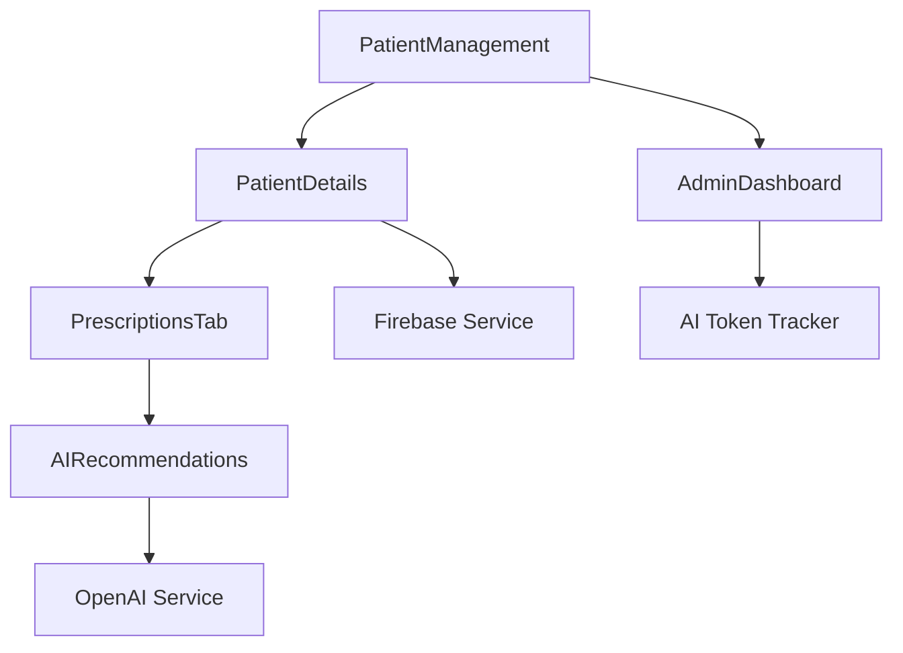

# Component Guide

## Overview
This guide provides detailed information about each component in the Prescribe medical system, their functionality, and implementation details.

## Core Components

### 1. PatientDetails.svelte
**Location**: `src/components/PatientDetails.svelte`
**Purpose**: Main patient management interface with comprehensive patient data handling

#### Key Features
- **Patient Information Display**: Shows patient details with conditional rendering
- **Tab Navigation**: Overview, Symptoms, Reports, Diagnoses, Prescriptions
- **AI Integration**: AI-powered drug suggestions and medical analysis
- **Prescription Management**: Create, edit, and manage prescriptions
- **Current Medications**: Track active medications with remaining duration

#### Props
```javascript
export let selectedPatient = null
export let doctorId = null
export let onPatientUpdate = null
export let onPrescriptionUpdate = null
```

#### Key Methods
```javascript
// Load patient data
async function loadPatientData() {
  // Loads patient information, prescriptions, and medical history
}

// Handle tab changes
function handleTabChange(tab) {
  // Switches between different patient data views
}

// Generate AI drug suggestions
async function generateAIDrugSuggestions() {
  // Calls OpenAI API for drug recommendations
}

// Add medication to prescription
async function addMedicationToPrescription(medication) {
  // Adds medication to current prescription
}
```

#### State Variables
```javascript
let activeTab = 'overview'
let currentPrescription = null
let currentMedications = []
let prescriptions = []
let symptoms = []
let reports = []
let diagnoses = []
let showMedicationForm = false
let editingMedication = null
```

### 2. PatientManagement.svelte
**Location**: `src/components/PatientManagement.svelte`
**Purpose**: Patient list management and dashboard overview

#### Key Features
- **Patient List**: Display all patients for the current doctor
- **Search and Filter**: Find patients by name or other criteria
- **Statistics Dashboard**: Show patient statistics and metrics
- **Patient Creation**: Add new patients to the system
- **Quick Actions**: Quick access to common patient operations

#### Props
```javascript
export let doctorId = null
export let onPatientSelect = null
export let onPatientCreate = null
```

#### Key Methods
```javascript
// Load patients
async function loadPatients() {
  // Loads all patients for the current doctor
}

// Load statistics
async function loadStatistics() {
  // Calculates and displays patient statistics
}

// Search patients
function searchPatients() {
  // Filters patients based on search criteria
}

// Create new patient
async function createPatient(patientData) {
  // Creates a new patient record
}
```

### 3. AdminDashboard.svelte
**Location**: `src/components/AdminDashboard.svelte`
**Purpose**: Administrative controls and system management

#### Key Features
- **Doctor Management**: Manage doctor accounts and permissions
- **Token Quota Management**: Set and monitor AI token quotas
- **Usage Analytics**: Track system usage and performance
- **System Configuration**: Configure system-wide settings
- **User Analytics**: Monitor user activity and engagement

#### Key Methods
```javascript
// Set doctor quota
async function saveQuota() {
  // Sets monthly token quota for a doctor
}

// Apply default quota
async function applyDefaultQuotaToAll() {
  // Applies default quota to all doctors
}

// Save token price
async function saveTokenPrice() {
  // Sets price per million tokens
}

// Refresh usage stats
async function refreshDoctorUsageStats() {
  // Updates usage statistics for all doctors
}
```

### 4. PharmacistDashboard.svelte
**Location**: `src/components/PharmacistDashboard.svelte`
**Purpose**: Pharmacist interface for prescription management

#### Key Features
- **Prescription Viewing**: View prescriptions sent by doctors
- **Inventory Management**: Track medication stock levels
- **Prescription Status**: Update prescription fulfillment status
- **Doctor Connections**: Manage connections with doctors
- **Prescription History**: View historical prescription data

#### Key Methods
```javascript
// Load prescriptions
async function loadPrescriptions() {
  // Loads prescriptions for the pharmacist
}

// Update prescription status
async function updatePrescriptionStatus(prescriptionId, status) {
  // Updates the status of a prescription
}

// Manage inventory
async function updateInventory(medicationId, quantity) {
  // Updates medication inventory levels
}
```

### 5. AIRecommendations.svelte
**Location**: `src/components/AIRecommendations.svelte`
**Purpose**: AI-powered drug suggestions and medical analysis

#### Key Features
- **Drug Suggestions**: AI-generated medication recommendations
- **Medical Analysis**: Comprehensive medical analysis
- **Drug Interactions**: Check for potential drug interactions
- **Context Awareness**: Uses patient data for personalized suggestions
- **Token Tracking**: Monitors AI token usage

#### Props
```javascript
export let symptoms = []
export let currentMedications = []
export let patientAge = null
export let patientAllergies = null
export let doctorId = null
export let patientData = {}
```

#### Key Methods
```javascript
// Generate drug suggestions
async function generateDrugSuggestions() {
  // Calls OpenAI API for drug recommendations
}

// Generate combined analysis
async function generateCombinedAnalysis() {
  // Provides comprehensive medical analysis
}

// Add AI suggested drug
async function addAISuggestedDrug(drug) {
  // Adds AI-suggested drug to prescription
}
```

## Utility Components

### 6. LoadingSpinner.svelte
**Location**: `src/components/LoadingSpinner.svelte`
**Purpose**: Loading indicator component

#### Features
- **Three Dots Animation**: Simple, clean loading animation
- **Customizable Size**: Different sizes for different contexts
- **Accessibility**: Screen reader friendly

### 7. ThreeDots.svelte
**Location**: `src/components/ThreeDots.svelte`
**Purpose**: Inline loading indicator

#### Features
- **Minimal Design**: Simple three dots animation
- **Inline Usage**: Can be used within text or buttons
- **Lightweight**: Minimal performance impact

### 8. PrescriptionsTab.svelte
**Location**: `src/components/PrescriptionsTab.svelte`
**Purpose**: Prescription management interface

#### Key Features
- **Prescription List**: Display all prescriptions for a patient
- **Medication Management**: Add, edit, and remove medications
- **AI Suggestions**: Access to AI-powered drug suggestions
- **Prescription Finalization**: Complete prescription process

#### Props
```javascript
export let selectedPatient = null
export let currentPrescription = null
export let currentMedications = []
export let onNewPrescription = null
export let onAddDrug = null
export let onGenerateAISuggestions = null
export let onAddAISuggestedDrug = null
export let onRemoveAISuggestedDrug = null
```

## Component Communication

### Event Flow


### Data Flow
1. **PatientManagement** loads patient list
2. **PatientDetails** displays selected patient
3. **PrescriptionsTab** manages prescriptions
4. **AIRecommendations** provides AI suggestions
5. **Firebase Service** handles data persistence
6. **AI Token Tracker** monitors usage

## Styling Guidelines

### Flowbite Components
All components use Flowbite UI components for consistency:
- **Buttons**: `bg-teal-600 hover:bg-teal-700`
- **Cards**: `bg-white rounded-lg shadow`
- **Modals**: `fixed inset-0 z-50`
- **Forms**: `bg-gray-50 border border-gray-300`

### Color Scheme
- **Primary**: Teal (`#0d9488`)
- **Secondary**: Gray (`#6b7280`)
- **Success**: Green (`#10b981`)
- **Warning**: Yellow (`#f59e0b`)
- **Error**: Red (`#ef4444`)

### Responsive Design
- **Mobile First**: Components designed for mobile, enhanced for desktop
- **Breakpoints**: `sm:`, `md:`, `lg:`, `xl:`
- **Flexible Layouts**: Grid and flexbox for responsive design

## State Management

### Local State
Each component manages its own local state:
```javascript
let isLoading = false
let error = null
let data = []
```

### Global State
Shared state through props and events:
```javascript
// Parent to child
export let selectedPatient = null

// Child to parent
dispatch('patient-updated', { patient: newPatient })
```

### Reactive Statements
Svelte's reactive statements for automatic updates:
```javascript
$: if (selectedPatient) {
  loadPatientData()
}

$: filteredData = data.filter(item => 
  item.name.includes(searchTerm)
)
```

## Error Handling

### Component Level
```javascript
try {
  await loadData()
} catch (error) {
  console.error('Error loading data:', error)
  error = 'Failed to load data'
}
```

### Global Level
```javascript
// Error boundary component
function handleError(error) {
  console.error('Global error:', error)
  // Show user-friendly error message
}
```

## Performance Considerations

### Lazy Loading
```javascript
// Load components only when needed
const HeavyComponent = lazy(() => import('./HeavyComponent.svelte'))
```

### Memoization
```javascript
// Cache expensive calculations
$: expensiveValue = computeExpensiveValue(data)
```

### Virtual Scrolling
```javascript
// For large lists
{#each visibleItems as item (item.id)}
  <ItemComponent {item} />
{/each}
```

## Testing

### Unit Tests
```javascript
// Test component logic
import { render } from '@testing-library/svelte'
import PatientDetails from './PatientDetails.svelte'

test('renders patient information', () => {
  const { getByText } = render(PatientDetails, {
    props: { selectedPatient: mockPatient }
  })
  expect(getByText('John Doe')).toBeInTheDocument()
})
```

### Integration Tests
```javascript
// Test component interactions
test('adds medication to prescription', async () => {
  const { getByRole, getByText } = render(PatientDetails)
  await fireEvent.click(getByRole('button', { name: 'Add Drug' }))
  expect(getByText('Medication added')).toBeInTheDocument()
})
```

## Accessibility

### ARIA Labels
```html
<button aria-label="Add medication" on:click={addMedication}>
  <i class="fas fa-plus"></i>
</button>
```

### Keyboard Navigation
```html
<button tabindex="0" on:keydown={handleKeydown}>
  Action Button
</button>
```

### Screen Reader Support
```html
<div role="alert" aria-live="polite">
  {errorMessage}
</div>
```


